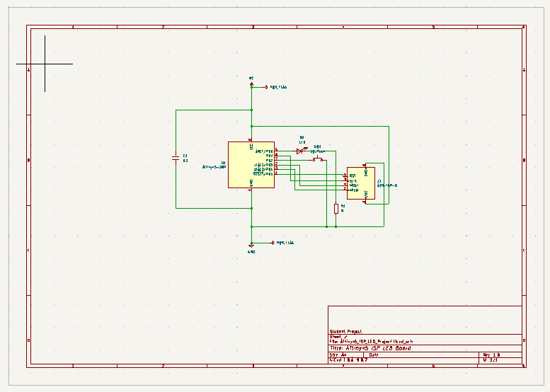
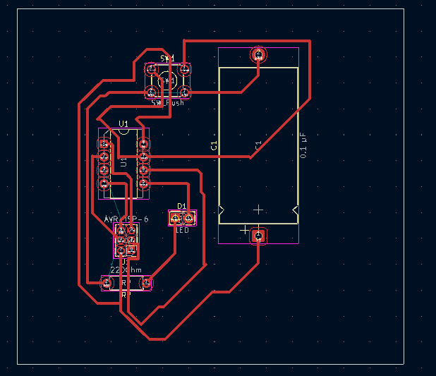

# 3. Activity of Day 3: PCB Designing using KiCAD application.

## Objective of this Activity.
As Learners, we were tasked to be able to design a PCB using KiCAD and to be able to print that PCB board as line Cutter board.

## 1.First Step: Designing schematic Diagram.
by using the KiCAD, first i have to design the circuit diagram for my task work which was a "ATtiny45 LED Control with Push Button & ISP Programming". The pocedure is to:
1. To open the KiCAD application
2. Create new project
3. open the schematic Editor
4. Design the circuit diagram which is shown bellow

{ width=300 Height=200 align=middle }
5. After Check if there is no errors in the circuit by using ERC(Electrical Rules Checker).

## 2.Second Step: Assigning Footprint to the diagram and move to PCB Editor
After designing the schematic diagram through schematic editor and correcting any errors by using ERC for correcting. the next step is to assign footprint to the Diagram for finalizing the design. Assigning Footprint to the schema is for creating printable path of interconnections between I/O pins of every devices used in the schema. so the next procedure is to:
1. Assigning Footprint
2. switch to PCB Editor
3. Assign path way as it is shown in the following picture

{ width=300 Height=200 align=middle }

## 3. Third Step: Ready to be Printable
After Editing the PCB design made, it is now the step of printing that schema on PCB Cupper  material. where it cuts the same path ways shown in the design.

* Download reference

Links to reference files, PDF, booklets,

